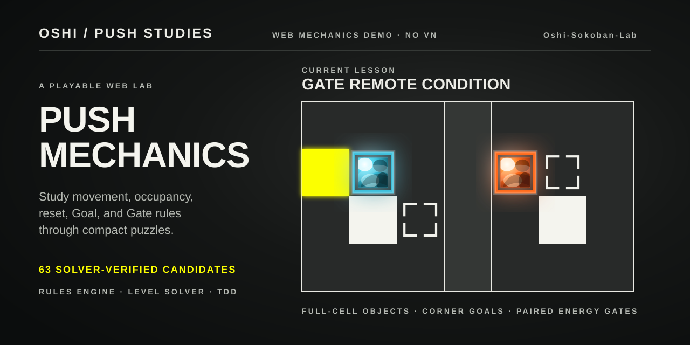

# Oshi-Sokoban-Lab

Continuing on another computer? Start with the [handoff](HANDOFF.md) (2026-09-12: task history, decisions, pending work, and asset index).

[简体中文](README.zh-CN.md)

A playable web lab created by the original author of Oshi to reconstruct and extend its grid-push mechanics. It focuses on the puzzle layer only—without the visual-novel narrative or original art and audio assets—and provides a test-driven space for mechanics fidelity and level-design research.



## Play locally

This repository does not currently host a public build. Install Node.js and npm, then run:

```powershell
npm install
npm run dev
```

Open the local URL printed by Vite.

## How to play

- Choose a lesson, read its briefing, then select **Start lesson**.
- Move with the arrow keys or `W`, `A`, `S`, and `D`; the on-screen direction buttons provide the same inputs.
- Press `Z` to undo and `R` to restart.
- Completing a lesson keeps the solved board visible and reveals an explicit **Next lesson** button.
- `npm run dev` uses unrestricted lesson selection for authoring and playtesting; production builds retain the prerequisite-based course mode.

## What is here

- Two isolated course catalogs: the accepted 60-level foundation used in production, and a development-only `mastery-v2` draft that currently exposes 70 playable formal levels against a fixed 120-slot, five-act blueprint.
- Ten machine-verified Push-side × Footprint mastery candidates (`P1–P10`). Their D3–D8 labels are design targets only until the required blind-test samples calibrate them.
- Three unaccepted Spike destroy/rebirth prototypes live in the development laboratory and do not count toward either catalog's formal progress.
- A pure state-machine engine for player movement, pushing, shaped entities, terrain Goals and Spikes, movable Goals, paired Gates, undo, restart, and optional step or time limits.
- A source-audited rules model covering numbered Goals, Fake Blocks, Rain movement, Gate topology, and Spike resets. Path-driven moving Spikes remain outside the main course until their dynamic state is statically readable.
- Grid-aligned CSS/SVG rendering with shared visual marks for the board and rule legend, including animated movement, two-part Gate travel, and a three-stage Spike destroy/rebirth presentation.
- A test-first authoring workflow: typed proof conditions, accepted-level fingerprints, stable-ID progress, actual-engine A*/Dijkstra search, explicit budget exhaustion, alternative macro-strategy checks, deadlock pruning, counterfactual theorem checks, mutation audits, replay, and interface flows.

## Development

```powershell
npm test
npm run typecheck
npm run build
```

The project uses React, TypeScript, and Vite. The rule engine lives in [`src/engine`](src/engine); declarative level families live in [`src/levels`](src/levels); the UI only renders state and dispatches player input.

## Status and scope

Production still defaults to the creator-accepted 60-level foundation. The draft `mastery-v2` catalog currently contains those 60 frozen levels plus `P1–P10`, for 70 playable formal boards; all ten new boards are solver-replayable, require their declared proof conditions, and have no unlabelled redundant board element under the current mutation audit. This is a machine-verified milestone, not evidence that P10 has reached a human D8 ceiling.

The remaining 50 blueprint slots are deliberately not being filled as unchecked content. The plan requires P1–P6 difficulty/transfer testing, then P7–P10 testing, before authoring P11–P12; P12 needs creator acceptance and expert blind testing before the H/G/I/R/T/S/C/U arcs expand horizontally. The early Spike prototypes remain in the laboratory, while the formal blueprint reserves eight separated hazard-only bridges before the reset-as-remote-movement reveal at slots 70–75. Path Spike remains outside the teaching route. This is the original creator's mechanics and level-design lab, not a full web port of Oshi.

## Research basis

The implementation is verified against the creator's public Oshi source snapshot [`main @ 4afe6809`](https://github.com/onovich/Oshi/tree/4afe6809aaef0894b5f27b543dff84b437bebb45). See the [web-demo specification](research/04-oshi-mechanics-web-demo-spec.md), [mechanics conformance audit](research/10-mechanics-conformance-audit.md), [Witness / SSR design study](research/15-witness-ssr-level-design-study.md), [mastery implementation map](docs/wayfinder/mastery-curriculum/map.md), [120-slot blueprint](src/course/mastery-blueprint.ts), [historical 63-board foundation plan](docs/level-family-curriculum-plan.md), and [blind-test protocol](docs/playtest-protocol.md).

## License

No open-source license is currently included in this repository.
