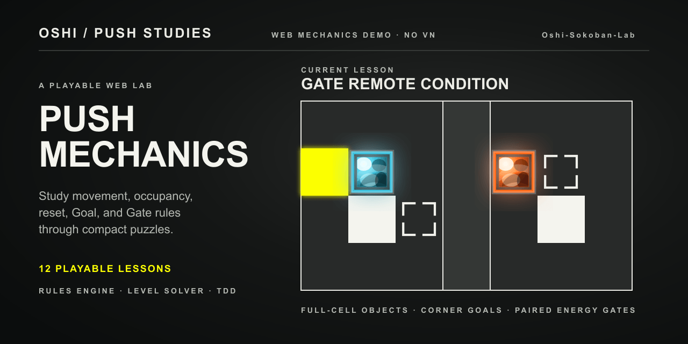

# Oshi-Sokoban-Lab

[简体中文](README.zh-CN.md)

A playable web lab created by the original author of Oshi to reconstruct and extend its grid-push mechanics. It focuses on the puzzle layer only—without the visual-novel narrative or original art and audio assets—and provides a test-driven space for mechanics fidelity and level-design research.



## Play locally

This repository does not currently host a public build. Install Node.js and npm, then run:

```powershell
npm install
npm run dev
```

Open the local URL printed by Vite.

## How to play

- Choose a lesson, read its briefing, then select **Start lesson**.
- Move with the arrow keys or `W`, `A`, `S`, and `D`; the on-screen direction buttons provide the same inputs.
- Press `Z` to undo and `R` to restart.
- Completing a lesson keeps the solved board visible and reveals an explicit **Next lesson** button.

## What is here

- Twelve compact, solvable lessons arranged as four three-stage technique groups: whole-occupancy checks, Spike reset positioning, movable-Goal mode switching, and Gate remote pushability.
- A pure state-machine engine for player movement, pushing, shaped entities, terrain Goals and Spikes, movable Goals, paired Gates, undo, restart, and optional step or time limits.
- A source-audited rules model that also covers numbered Goals, Fake Blocks, Rain movement, and Path-driven moving Spikes; those mechanics are not all part of the first 12-lesson course.
- Grid-aligned CSS/SVG rendering with shared visual marks for the board and rule legend, including animated movement and two-part Gate travel.
- A test-first course workflow: engine behavior, source conformance, interface flows, curriculum structure, bounded state-space solvability, and displayed walkthroughs are tested.

## Development

```powershell
npm test
npm run typecheck
npm run build
```

The project uses React, TypeScript, and Vite. The rule engine lives in [`src/engine`](src/engine); declarative level families live in [`src/levels`](src/levels); the UI only renders state and dispatches player input.

## Status and scope

The playable core and the first 12 single-mechanic lessons are implemented and verified locally. The larger 60-level curriculum remains a roadmap; Path Spike is intentionally outside the main teaching route until its readability requirements are met. This is the original creator's mechanics and level-design lab, not a full web port of Oshi.

## Research basis

The implementation is verified against the creator's public Oshi source snapshot [`main @ 4afe6809`](https://github.com/onovich/Oshi/tree/4afe6809aaef0894b5f27b543dff84b437bebb45). See the [web-demo specification](research/04-oshi-mechanics-web-demo-spec.md), [mechanics conformance audit](research/10-mechanics-conformance-audit.md), and [level-family curriculum plan](docs/level-family-curriculum-plan.md) for evidence and planned work.

## License

No open-source license is currently included in this repository.
