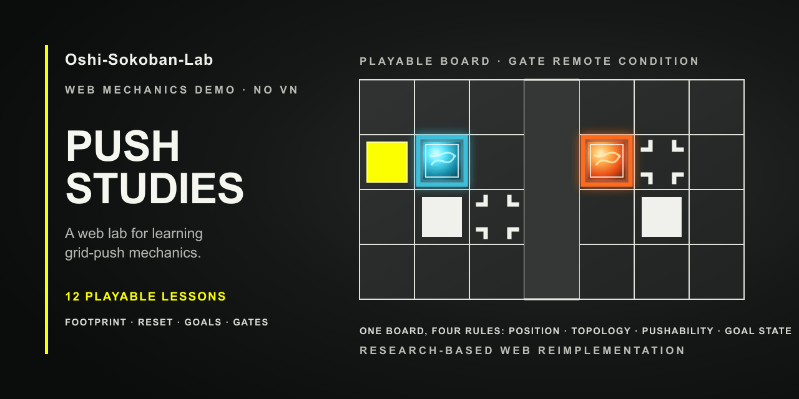

# Oshi-Sokoban-Lab

[English](README.md)

这是一个非官方、可游玩的 Web 机制实验室，用来研究受 Oshi 启发的网格推箱子规则。它只还原推箱子玩法层：不包含视觉小说叙事、原始美术或音频资源，也不宣称与原作存在官方关联。



## 本地试玩

仓库当前没有托管的公开版本。安装 Node.js 与 npm 后，运行：

```powershell
npm install
npm run dev
```

在浏览器中打开 Vite 输出的本地地址。

## 玩法

- 选择关卡、阅读开局说明，然后点击 **开始关卡**。
- 使用方向键或 `W`、`A`、`S`、`D` 移动；屏幕上的方向按钮提供相同输入。
- 按 `Z` 撤销，按 `R` 重开。
- 通关后会保留已解开的棋盘，并明确显示 **下一关** 按钮。

## 已包含内容

- 12 个紧凑且有解的关卡，分为四个三关技巧组：整块占格检查、Spike 回位改变站位、可推动 Goal 状态切换、Gate 远端可推性。
- 一个纯状态机规则内核，处理角色移动、推送、多格实体、地面 Goal 与 Spike、可推动 Goal、成对 Gate、撤销、重开，以及可选步数／时间限制。
- 一套经源码审计的规则模型，也覆盖编号 Goal、Fake Block、Rain 移动和 Path 驱动的移动 Spike；这些机制并未全部进入首批 12 关课程。
- 与网格完全对齐的 CSS/SVG 渲染；棋盘与规则图例共用同一套视觉符号，并包含位移动画及两段式 Gate 穿行。
- 测试先行的关卡工作流：规则内核、源码一致性、界面流程、课程结构、有界状态空间可解性及展示路线均有测试。

## 开发

```powershell
npm test
npm run typecheck
npm run build
```

项目使用 React、TypeScript 与 Vite。规则内核位于 [`src/engine`](src/engine)；声明式关卡族位于 [`src/levels`](src/levels)；UI 只负责渲染状态和派发玩家输入。

## 状态与范围

可游玩的核心流程与首批 12 个单机制关卡已经实现并在本地验证。完整的 60 关课程仍是路线图；在满足可读性要求前，Path Spike 会刻意排除在主教学路线之外。本仓库是机制研究项目，并不替代原作游戏。

## 调研依据

规则依据 Oshi 官方公开仓库的 [`main @ 4afe6809`](https://github.com/onovich/Oshi/tree/4afe6809aaef0894b5f27b543dff84b437bebb45) 调研。证据与后续工作可参阅 [Web demo 规格](research/04-oshi-mechanics-web-demo-spec.md)、[机制一致性审计](research/10-mechanics-conformance-audit.md) 与 [关卡族课程蓝图](docs/level-family-curriculum-plan.md)。

## 许可证

本仓库目前未包含开源许可证。
